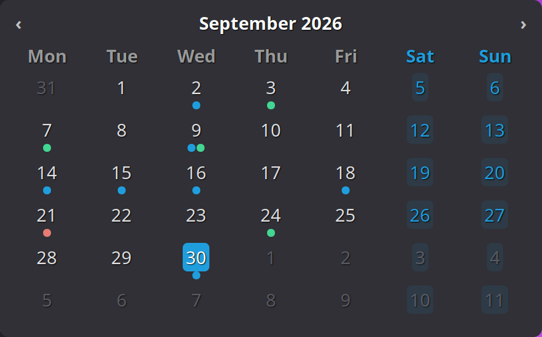

# Big Calendar

A large, configurable month-view calendar for the Cinnamon desktop, with events
from the calendars already connected in Online Accounts.



Everything about it is configurable — size, colours, layout, which events are
shown and how. It reads the calendars your system already knows about, so
there is nothing to log into and no password to give it.

---

## What it does

- **Month view** with the day numbers, week numbers (ISO 8601 or North
  American), and weekends tinted in their own colour.
- **Your events**, from every calendar in Online Accounts: Google, Nextcloud,
  Microsoft, CalDAV, or a local one. Shown as coloured dots, coloured bars, or
  the event titles themselves — whichever fits your desktop.
- **Hover tooltips** headed by the date, listing that day's events with their
  start times, each row on a band of its own calendar's colour.
- **Paging** through months with the arrows or the scroll wheel, and the month
  you were on is remembered for next time. Whenever you are looking at some
  other month, a **Today** button appears in the header to bring you back.
- **Everything scales** from one setting: text size drives the whole calendar,
  from a 466×329 corner widget at 100 % up to 1754×995 at 400 %, which is
  nearly the full width of a 1920-wide screen. The default, 200 %, gives
  893×555.
- Light and dark themes both work — it starts from the Mint-Y palette and every
  colour is a setting.

## Requirements

- Cinnamon 6.0 or newer.
- For events: at least one account added in **System Settings → Online
  Accounts** (or Online Accounts in the Cinnamon settings). The desklet needs
  `gir1.2-ecal-2.0`, `gir1.2-edataserver-1.2` and `gir1.2-ical-3.0`, which
  Cinnamon depends on already.

Without a connected account the calendar still works; it just has no events to
show.

## Installing

Two lines in a terminal. No root, nothing outside your home directory:

```sh
curl -fsSLO https://github.com/hardtomakeanadress/cinnamon-big-calendar/releases/latest/download/bigCalendar@adis.zip
unzip -q bigCalendar@adis.zip && ./bigCalendar@adis/install.sh
```

The calendar is on your desktop when it finishes. The installer checks that the
machine can run the desklet, copies the files into
`~/.local/share/cinnamon/desklets/`, and enables it — leaving your other
desklets alone.

Nothing is piped into a shell. The second line runs `install.sh`, which is a
readable script you can open first, and which will tell you what it found
without changing anything:

```sh
./bigCalendar@adis/install.sh --check       # report what was found, change nothing
./bigCalendar@adis/install.sh --uninstall   # remove it, keeping your settings
```

If you would rather check the download before running it, the release carries a
checksum beside the archive:

```sh
curl -fsSLO https://github.com/hardtomakeanadress/cinnamon-big-calendar/releases/latest/download/bigCalendar@adis.zip.sha256
sha256sum -c bigCalendar@adis.zip.sha256
```

From a checkout of the source the same script does the same thing, and
`./deploy.sh` in addition reloads the desklet in the running session so an edit
takes effect without restarting Cinnamon. `./deploy.sh --disable` removes it.

**To take it off the desktop and put it back**, right-click it and choose
*Remove this desklet*, or use **Menu → Desklets**. Your settings are kept, so
it returns configured as you left it — and it can be taken off whenever you
want it out of the way rather than staying there permanently. (That is not how
Cinnamon behaves by default: it deletes a desklet's settings when the desklet
is removed, and skips that only for a desklet limited to a single instance.
This one declares `max-instances` 1 for exactly that reason.)

Cinnamon's desklet dialog has no "install from a file" button — it only
downloads from the spices server — so the script is the way in. The archive is
built to the layout that server expects regardless, with a single
`bigCalendar@adis/` folder at the top.

## Privacy

The short version: **the desklet has no account, no password and no network
code of its own.** It asks your own system what your events are, and draws the
answer. Nothing about you leaves the machine because of this desklet.

Concretely:

- **It stores no credentials.** There is no OAuth client ID, no token, no
  password, and no calendar URL anywhere in this repository. Google sign-in is
  handled entirely by Online Accounts, which keeps the token in your system
  keyring under your distribution's control — the same token the Calendar
  application uses. Deleting the account in Online Accounts removes the
  desklet's access with it.
- **It talks to no server.** The only thing it contacts is
  `evolution-data-server`, over the session D-Bus on your own machine. That
  service is what actually talks to Google, refreshing tokens and caching
  results for offline use — exactly as it already does for the Calendar
  application and for GNOME's clock. The desklet is a reader of data that is on
  your machine already. **Every call it makes is asynchronous**, so nothing it
  asks for can freeze the desktop while it waits — not even if
  `evolution-data-server` is wedged. It does its own date arithmetic on what
  comes back:
  `evolution-data-server` returns a repeating event as the single rule that
  defines it, not as the individual occurrences, so the desklet expands the
  rule itself (see `lib/calendarSource.js`).
- **It has no analytics, telemetry, update check or crash reporting.** There is
  nothing to opt out of, because there is nothing there.
- **It writes one file**: the Cinnamon settings file holding your appearance
  choices and the month you last viewed
  (`~/.config/cinnamon/spices/bigCalendar@adis/`). Event data is never written
  anywhere by the desklet.
- **It is plain, readable source.** No bundled libraries, no minified files, no
  compiled blobs. Four files of JavaScript, one stylesheet, one JSON schema.

You do not have to take any of that on trust. To check it:

```sh
# Nothing should mention a hostname, a token or an HTTP client.
grep -rniE 'https?://|soup|fetch\(|oauth|client_id|token|password' \
    desklet.js lib/ settings-schema.json

# Watch it run: the desklet opens no TCP connections of its own.
ss -tnp | grep -i cinnamon
```

The only `https://` strings in the source are the licence headers.

## Settings

All of these are in the desklet's **Configure** dialog, sorted into four pages.

### Appearance

**Size and spacing**

| Setting | Key | Default |
|---|---|---|
| Text size | `font-scale` | 200 % (50–400) |
| Inner padding | `padding` | 16 px (0–80) |
| Corner roundness of day highlights | `cell-radius` | 8 px (0–40) |

**Background**

| Setting | Key | Default |
|---|---|---|
| Background colour | `bg-color` | `#303036` |
| Background opacity | `bg-opacity` | 85 % (0–100) |
| Corner radius of the calendar | `corner-radius` | 14 px (0–60) |
| Border thickness | `border-width` | 0 px (0–10) |
| Border colour | `border-color` | `#3c3c44` |
| Draw grid lines between days | `show-grid-lines` | off |
| Grid line colour | `grid-line-color` | `#3c3c44` |

**Text colours**

| Setting | Key | Default |
|---|---|---|
| Day numbers | `text-color` | `#e1e1e1` |
| Month and year | `header-color` | `#ffffff` |
| Weekday headings | `weekday-color` | `#9a9a9a` |
| Weekend days | `weekend-color` | `#1f9ede` |
| Days outside this month | `other-month-color` | `#6a6a72` |
| Fade days from other months | `dim-other-months` | on |
| Fade amount | `other-month-opacity` | 35 % (0–100) |

**Today**

| Setting | Key | Default |
|---|---|---|
| Highlight today with | `today-style` | Filled background |
| Highlight colour | `today-bg-color` | `#1f9ede` |
| Today's number colour | `today-text-color` | `#ffffff` |

**Weekends**

| Setting | Key | Default |
|---|---|---|
| Tint weekend days | `tint-weekends` | on |
| Weekend tint strength | `weekend-tint-strength` | 10 % (0–60) |

### Layout

**Week**

| Setting | Key | Default |
|---|---|---|
| Week starts on | `week-start` | Match my system |
| Week numbering | `week-numbering` | ISO 8601 |
| Show week numbers | `show-week-numbers` | off |
| Week number colour | `week-number-color` | `#6a6a72` |

**Month grid**

| Setting | Key | Default |
|---|---|---|
| Rows | `rows` | Always six (fixed height) |
| Header format | `month-format` | September 2026 |

**Header**

| Setting | Key | Default |
|---|---|---|
| Show month navigation arrows | `show-navigation` | on |
| Arrow colour | `nav-color` | `#c3c3c3` |

### Events

**Calendars**

| Setting | Key | Default |
|---|---|---|
| Show events from my calendars | `show-events` | on |

**Appearance**

| Setting | Key | Default |
|---|---|---|
| Show each day's events as | `event-style` | Coloured dots |
| Most indicators per day | `event-max` | 3 (1–8) |
| Clock | `event-time-format` | Match my system |
| List a day's events on hover | `show-event-tooltips` | on |

**Refresh**

| Setting | Key | Default |
|---|---|---|
| Re-check for changes every | `event-refresh` | 20 min (5–240) |

### Behaviour

| Setting | Key | Default |
|---|---|---|
| Open on the current month | `start-on-today` | on |
| Change month with the scroll wheel | `mouse-wheel-navigation` | on |

## Known limitations

These are real and worth knowing before you rely on the desklet.

- **All calendars are shown, with no per-calendar filter.** There is no way yet
  to hide, say, a birthday calendar while keeping your work one. The
  `show-events` setting is all-or-nothing.
- **A day shows fewer dots than `event-max` when they will not fit.** The dots
  are drawn to a fixed pixel size and the cell is only so wide, so the desklet
  caps the row at what actually fits and counts the rest into the `+N` label —
  eight dots at the smallest text size would otherwise spill over the days on
  either side. The count is always in the tooltip.
- **Years 0000–0099 are not handled.** The desklet uses two-digit years
  internally in one place where four-digit years would be needed to cover
  them. No real calendar data is affected.
- **The screenshot above shows the background fully opaque.** The default is
  85 %, so on your desktop the wallpaper shows through slightly. The opaque
  render is used only so the image reads clearly in a README.

## Development

```sh
cjs -m tests/run-tests.js         # grid, formatting and indexing   (57 passing)
cjs -m tests/timezone.js          # all-day and zoned-event dates    ( 9 passing)
cjs -m tests/recurrence.js        # repeating-event expansion        (16 passing)
cjs -m tests/feed.js              # connecting and reconnecting      ( 5 passing)
cjs -m tests/integration.js       # reads the real evolution-data-server on this machine
./install.sh --check              # can this machine run the desklet?
./deploy.sh                       # install and reload in the running session
./shot.sh out.png                 # screenshot the desklet as it renders; --opaque flattens the background
./tools/hover.py X Y              # move the pointer, to check hover behaviour by hand
./tools/click.py X Y              # click at a point, to drive the settings dialog
./tools/make-icon.py              # redraw icon.png from its script rather than editing the image
./tools/make-pot.sh               # regenerate po/bigCalendar@adis.pot
./tools/make-dist.sh              # build dist/bigCalendar@adis.zip to install elsewhere
```

The first four need no desktop to run — they import `lib/` directly and skip
themselves if the calendar libraries are missing. Between them they cover the
things that are easy to get wrong and hard to notice: which civil date an
all-day event belongs to in a timezone behind UTC, whether a weekly series
survives a daylight-saving change, whether a long event stops being drawn past
its 400th day, and whether a calendar that was unreachable at startup is picked
up later.

`tests/integration.js` is the one that needs the real thing. It prints the
calendars it finds, the events in the current year, and checks that an all-day
event lands on the right civil date against live data.

### Reloading while you work

`./deploy.sh` reloads the desklet without restarting Cinnamon. Note for anyone
editing `lib/`: GJS caches ES modules by URI for the life of the process, so a
reload alone would keep running the old copies. `loadModules()` appends each
file's modification time to its import URI, which is what makes an edit take
effect on the next reload — and what stops an installed desklet from breaking
when it is updated in place.

### Layout notes for anyone editing this

Two things about St are worth knowing before you move a length back into the
stylesheet, because both cost real time to find:

1. **An em length is resolved against whichever font a widget had when its
   theme node was built.** A desklet's first render builds nodes before the
   root's font size has been handed down, so em lengths come out against the
   default font and stay that way. Every length that has to scale is computed
   in JavaScript by `_emToPx()` and set with `set_width()` / `set_height()`.
2. **A widget's theme node is resolved lazily, on its first allocation, and for
   a desklet that is earlier than the stylesheet reaching the theme.** The
   grid's inner widgets then lose the padding their class rules give them — the
   day cells came out 68px around 70px of contents, so every row overflowed
   into the next one. Giving a widget an inline style forces its node to be
   resolved while it is still being built, and the padding comes back. Not
   every widget is affected (the title bar keeps its padding unaided), so this
   was applied where it was measured wrong rather than everywhere.

The widths, the base font size and the grid's layout paddings are therefore in
`desklet.js`, and `stylesheet.css` holds none of them — only fonts, weights,
alignment, spacing and colours.

### Holding the input region, and letting go of it

Cinnamon follows the mouse over a desklet by tracking it as "chrome", and a
tracked actor is added to the stage's *input region* (`affectsInputRegion` in
`layout.js` defaults to true). That region belongs to the compositor's own
window, which sits above every application window. It cuts both ways, and both
halves are worth knowing before changing any of this:

- **It is the only thing that delivers mouse events to the desklet at all.**
  The day tooltips hang off a cell's `motion-event`, and that arrives only
  while the desklet is in the region. A desklet that gives the claim up to be
  polite stops responding to the mouse entirely — no hover, no tooltips, no
  scroll. That mistake was made here once, which is why `_trackMouse()` keeps
  the claim rather than dropping it.
- **Held over a window, it swallows that window's clicks.** Anything under the
  desklet stops receiving them in the overlap.

Cinnamon's own guard for the second half lives in `deskletManager`, and it asks
whether a window is under the *pointer*, twice a second. The pointer is the
wrong thing to ask about: a window covering half the desklet goes on losing
clicks in that half for as long as the pointer sits on the desklet's other
half, because Cinnamon never sees a reason to let go. The settings dialog is
the same case and worse — its tab row lies inside the desklet's rectangle, so a
claim held even briefly swallows the click that was meant to switch tabs.

So `_trackMouse()` holds the region only while nothing is over the desklet, and
`_syncInputRegion()` re-checks every 200 ms — as often as this needs to be,
given that what it races is someone moving a window and then clicking in it. A
`DESKTOP` or `DOCK` window does not count as being over it: the desktop sits
below the desklet and covers the whole screen, and a dock has its own claim on
the region.

### The day tooltip is not Cinnamon's

`Tooltips.Tooltip` is a single `St.Label`, so it can carry exactly one colour —
and the point of this tooltip is that every event keeps the colour it has in
the grid. So the day tooltip is its own small actor (`DayTooltip` in
`desklet.js`), which takes from Cinnamon's the parts a person actually notices:
the same wait before it appears, the same offset beside the pointer, and the
same flipping at the edge of the monitor so it never opens off-screen.

Two consequences worth knowing before editing it:

- **It lives in `Main.uiGroup`, not in the desklet.** It has to be able to hang
  over the edge of the calendar, and the desklet's own actor is clipped to its
  bounds. Nothing takes it down with the desklet, so `on_desklet_removed()`
  destroys it explicitly, and every render hides it — the cells it describes
  are about to be replaced.
- **The colour is the band, not the text.** A row's text is the one colour
  known to read on the tooltip's surface; the event's own colour is the ground
  it sits on. Written into the text it was a different colour on every row, and
  a red event came out as red letters on a red band — muddy exactly where it
  had to be read.
- **Each row's band is checked against the tooltip's own surface first.** The
  tooltip is drawn in the desklet's background colour, and an event colour too
  close to it is moved away until it can be told apart — lightened on a dark
  tooltip, darkened on a light one — in quarter-steps, so it keeps its hue. A
  colour that already stands out is left exactly as it is, which is most of
  them: an event's band is the colour of its dot in the grid. A ceiling as well
  as a floor, because a band bright enough to fight the text on it has stopped
  being a background. See `bandColor()`.
- **It is sized from the desklet's text size**, not the theme's. The tooltip
  hangs in the uiGroup, outside the desklet's actor, so nothing the desklet
  sets reaches it — without this it would render at the theme default beside
  day numbers twice as tall.

### Translating

`po/bigCalendar@adis.pot` holds every string, including the settings dialog's
descriptions and tooltips. Copy it to `po/LL.po`, translate, then:

```sh
msgfmt po/LL.po -o ~/.local/share/locale/LL/LC_MESSAGES/bigCalendar@adis.mo
```

which is the directory the desklet points gettext at.

## Licence

GPL-3.0-or-later. See [LICENSE](LICENSE).
